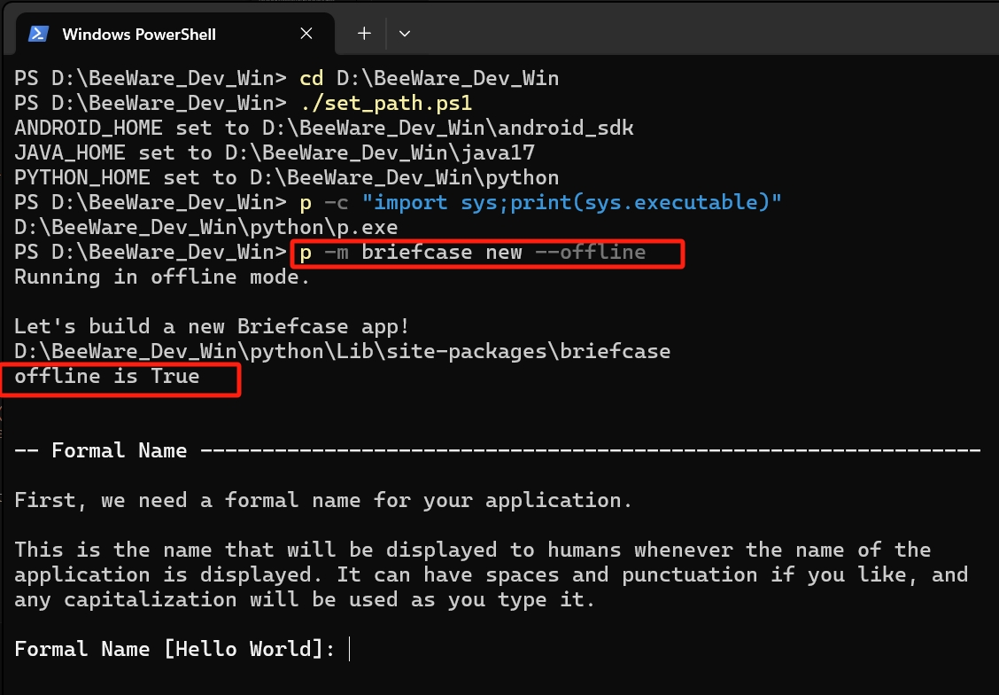

# Briefcase with Offline Template embedded

This is a personal fork of the original briefcase project with several embedded templates.
It is for the usage of users who can hardly visit GtiHub and not recommend to install it on any other situation.

On windows, there might be error occurred since not having Windows Long Path support enabled.

You can find information on how to enable this at https://pip.pypa.io/warnings/enable-long-paths

```Reg
Windows Registry Editor Version 5.00

[HKEY_LOCAL_MACHINE\SYSTEM\CurrentControlSet\Control\FileSystem]
"LongPathsEnabled"=dword:00000001
```

## Installation

### Install with pip

You may directly install it with pip.

```Bash
git config --system core.longpaths true
pip install git+https://github.com/cycleuser/briefcase-offline.git
```

If you can hardly visit GtiHub, please use the commands below:

```Bash
git config --system core.longpaths true
pip install git+https://gitlab.com/GeoPyTool/briefcase-offline.git
```

### Clone and Install

Please notice that the path can be really long, so you may need to set `core.longpaths` to `true` in your git config. But you may still encounter some problems like `No such file or directory` errors on some templates.

To sole this, just go to a directory with a short path, and then clone the repository.
For example:

```Bash
cd D:/
git clone https://github.com/cycleuser/briefcase-offline.git
cd briefcase
pip install .
```

## Use it

Then use an `--offline` flag to use the embedded templates.

```Bash
python -m briefcase new --offline
```


If you want to use onlie templates, just remove the `--online` flag.

```Bash
python -m briefcase new
```


# A Partial Offline Pack

The purpose of this part is to make a pack with all the tools you need to develop a BeeWare app.

And what I have done is only to pack the tools needed and modify some parts of the code.

It is just for those who can not access to the GitHub and Google to download the related tools.

The pack can be really huge, but you can just download it and copy it anywhere.

You may still need to download gradle and using pypi even with this pack.

But at least these websites are not totally blocked in some particular area.

This is a pack with Python, JDK and Android SDK, currently for Windows only.

The Python is 3.12.1.
The JDK is 17.0.10.
The Android SDK is 33.0.3 and 34.0.0.

##### [Download Link of BeeWare_Dev_Win.zip](https://pan.baidu.com/s/1euElzjzQNxLxGvuel_BIUg?pwd=cuac)
##### It is too large (above 4G)s.

Link：https://pan.baidu.com/s/1euElzjzQNxLxGvuel_BIUg?pwd=cuac 
Code：cuac

Download the BeeWare_Dev_Win.zip and unzip it into a pure English path.
It should be like this.


Then open your powershell and run code below to enter the path.
Then you can just run the `set_path.ps1` file to activate the environment.

```Powershell
cd BeeWare_Dev_Win
./set_path.ps1
```

The `set_path.ps1` is just a file that deactives the current environment and set the new environment variables, including Android SDK, Java, and Python.

```Powershell
# set_path.ps1
conda deactivate
$CurrentPath = (Get-Location).Path
$AndroidSdkPath = Join-Path -Path $CurrentPath -ChildPath "android_sdk"
$JavaPath = Join-Path -Path $CurrentPath -ChildPath "java17"
$PythonPath = Join-Path -Path $CurrentPath -ChildPath "python"

$env:ANDROID_HOME = $AndroidSdkPath
$env:JAVA_HOME = $JavaPath
$env:PYTHON_HOME = $PythonPath

# Add the new Python path to the system Path
$env:Path += ";$PythonPath"

Write-Output "ANDROID_HOME set to $env:ANDROID_HOME"
Write-Output "JAVA_HOME set to $env:JAVA_HOME"
Write-Output "PYTHON_HOME set to $env:PYTHON_HOME"

# p -c "import sys;print(sys.executable)"
```

The output should be like below, where I put the `BeeWare_Dev_Win` under `D:\`.

```Powershell
(base) PS C:\Users\UserName> cd D:\BeeWare_Dev_Win
PS D:\BeeWare_Dev_Win> ./set_path.ps1
ANDROID_HOME set to D:\BeeWare_Dev_Win\android_sdk
JAVA_HOME set to D:\BeeWare_Dev_Win\java17
PYTHON_HOME set to D:\BeeWare_Dev_Win\python
PS D:\BeeWare_Dev_Win>
```

When finished the environment activation, you can run `p -c "import sys;print(sys.executable)"` to test.
It should print your customed location of `p.exe` which is a copy of `python.exe` under your `$PythonPath`.

Then you can run `p -m briefcase new --offline` to build a new beeware project directly without templates downloading progress.



In fact, just add the `p -m ` before `briefcase new` to make it work.

```Bash
p -m briefcase new --offline # create the project
p -m briefcase dev           # test the project
p -m briefcase update        # update the project
p -m briefcase update -r     # update dependencies
p -m briefcase run           # run default
p -m briefcase run Android   # Android
```

For Linux, I haven't get it work yet.